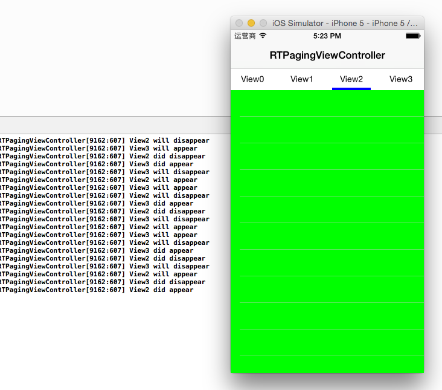

RTPagingViewController
=====================

## Description

**This is a iOS implementation for Android ViewPager.** Most existing third party container view controllers didn't manage children view controllers' view appearence life cycle properly.

In a normal case, a controller's view appearence method should be called in following order:

- `viewDidLoad:`
- `viewWillAppear:`
- `viewDidAppear:`
- `viewWillDisappear:`
- `viewDidDisappear:`
- ~~`viewDidUnload:`~~

So I decided to build my own Container Controller, which handles view appearence correcttly, and it takes time...

Finally, I have got the right result:

## Features

- Handle view appearence properly
- screen rotation support

## Usage

    FirstViewController *vc1 = ...;
    vc1.title = "View1";
    SecondViewController *vc2 = ...;
    vc2.title = "View2";
    ...
    
    RTPagingViewController *paging = [[RTPagingViewController alloc] init];
    paging.controllers = @[vc1, vc2, ...];
    paging.titleFont = ...;
    paging.titleColor = ...;
    paging.selectedTitleColor = ...;
    paging.titleIndicatorView = ...;

## Screenshot

## License

MIT
